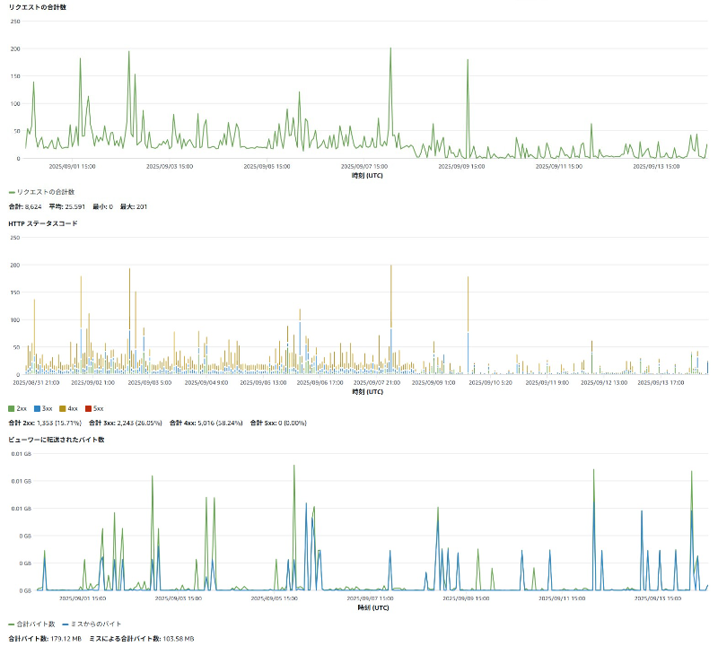

# AWS Infrastructure Engineer Portfolio

AWS認定ソリューションアーキテクトとして構築した、Infrastructure as Code（Terraform）による高性能なWebポートフォリオサイトです。企業レベルの監視システムとCI/CD自動化により、個人サイトでありながら本格的なクラウド運用を実現しています。

## 🌐 Live Demo
**[https://inatom-portfolio.com](https://inatom-portfolio.com)**

## 📋 プロジェクト概要

AWSクラウドでのサーバーレス静的ウェブサイトホスティングを、Infrastructure as Code（Terraform）で管理するポートフォリオサイト。セキュアで高可用性なアーキテクチャに加え、企業レベルの監視システムを実装し、完全自動化された運用を実現しています。

## 🏗️ システム構成

### AWSサーバーレスアーキテクチャ + 監視システム
  

### 全体システムフロー

```
[ユーザー] → [Route53] → [CloudFront] → [S3 Website]
             DNS         CDN           静的ホスティング
                          ↓
                    [CloudWatch Alarms] → [SNS通知]
                          ↓
                    [Lambda外形監視] (15分間隔)

[Developer] → [GitHub Actions] → [Terraform] → [AWS Infrastructure]
              CI/CD              IaC          自動デプロイ・監視設定
```

## 💻 使用技術・サービス

### AWS インフラストラクチャ
| サービス | 役割 | 技術選定理由 |
|----------|------|----------|
| **Amazon S3** | 静的ファイルホスティング | 高可用性・低コスト・スケーラビリティ |
| **CloudFront** | CDN・SSL終端 | グローバル配信・セキュリティ強化 |
| **Route53** | DNS管理 | 高信頼性・AWS統合・100%SLA |
| **ACM** | SSL証明書管理 | 自動更新・運用コスト削減 |
| **CloudWatch** | 監視・アラート | リアルタイム監視・メトリクス分析 |
| **Lambda** | 外形監視・メトリクス収集 | サーバーレス・15分間隔自動実行 |
| **SNS** | 通知システム | 障害検知時の即座メール通知 |
| **EventBridge** | スケジュール実行 | Lambda定期実行の制御 |
| **IAM** | 権限管理 | 最小権限原則・セキュア設計 |

### Infrastructure as Code & CI/CD
| 技術 | 用途 | 実装内容 |
|------|------|----------|
| **Terraform** | インフラ管理 | 全AWSリソースのコード化・バージョン管理 |
| **GitHub Actions** | CI/CD | 自動デプロイ・インフラ更新の自動化 |

### 開発・運用
| 技術 | 用途 | 活用方法 |
|------|------|----------|
| **Python** | 監視スクリプト | Lambda関数による外形監視・メトリクス収集 |
| **HTML5/CSS3** | フロントエンド | レスポンシブデザイン・セマンティック構造 |
| **JavaScript** | インタラクション | DOM操作・UI/UX向上 |
| **Git** | バージョン管理 | ソースコード・インフラコードの統合管理 |

## 🔍 企業レベル監視システム（2025年9月実装）

### 実装済み監視機能
- **CloudWatch Alarms**: リクエスト数・データ転送・レスポンス時間の多角的監視
- **SNS通知システム**: 障害検知時の即座メール通知（parmenara@gmail.com）
- **Lambda外形監視**: 15分間隔での自動サイトヘルスチェック・可用性測定
- **Composite Alarm**: 複数メトリクスを統合した総合的な稼働状況監視
- **EventBridge スケジューラー**: 定期監視タスクの自動実行制御
- **Infrastructure as Code**: Terraformによる監視設定の完全コード管理

### 監視メトリクス詳細
```python
# Lambda監視項目
- サイト可用性（SiteAvailability）: 200番台レスポンス判定
- レスポンス時間（ResponseTime）: ミリ秒単位での応答速度測定
- HTTPステータス監視: エラー発生時の即座検知

# CloudFront監視項目  
- リクエスト数（Requests）: アクセス状況の把握
- データ転送量（BytesDownloaded）: トラフィック監視
- オリジンレスポンス時間（OriginLatency）: 1秒以上で通知
```

### 技術的価値・差別化ポイント
個人ポートフォリオサイトでありながら、大企業SREチームが実装する監視手法を導入：

- **自動障害検知・通知システム**: 手動監視からの完全脱却
- **Infrastructure as Code**: 監視設定の再現性・保守性確保
- **複数観点からの包括的監視**: 単一障害点の排除
- **コスト効率重視**: 月額数十円での企業レベル監視実現
- **段階的アラート設計**: 重要度に応じた通知制御

  
*CloudFront監視データ：リクエスト数・HTTPステータス・データ転送量*

**詳細技術記事**: [Qiita - AWSポートフォリオサイト監視システム構築](https://qiita.com/parmenara/items/728ce35dbbc6c9915e0d)

## 🔒 セキュリティ実装

### Infrastructure Security
- **Origin Access Control (OAC)**: S3バケット完全非公開化
- **HTTPS強制**: ACM証明書によるエンドツーエンド暗号化
- **最小権限IAM**: 必要最小限のアクセス権限設定
- **tfstate暗号化**: Terraform状態ファイルのセキュア管理

### CI/CD Security
- **GitHub Secrets**: AWS認証情報の暗号化保存
- **自動デプロイ**: 手動操作によるヒューマンエラー防止

### 監視システムセキュリティ
- **Lambda実行権限**: CloudWatch書き込み最小権限
- **SNS通知**: 暗号化された通知チャネル
- **アクセスログ**: 全監視アクセスの記録・追跡

## ⚡ パフォーマンス設計・実測値

### CDN最適化
- **グローバル配信**: エッジロケーションでのキャッシュ配信
- **データ圧縮**: 転送効率化による高速読み込み
- **IPv6対応**: 次世代プロトコル対応

### 実測パフォーマンス
*最新の測定結果（2025年9月15日）*
- **PageSpeed Insights**: **100/100**
- **Lighthouse Score**: **93/100**
- **実際のロード時間**: **326ms**

### 監視システム仕様
- **監視間隔**: 15分（コスト効率重視）
- **通知方式**: SNSメール通知
- **監視対象**: サイト可用性・レスポンス時間・CloudFrontメトリクス

## 💰 コスト最適化

### 月額運用費（実績・監視込み）
```
Route53 (ホストゾーン): ¥75
ドメイン名 (.com): ¥150
S3 ストレージ・リクエスト: ¥10
CloudFront 配信: ¥250
CloudWatch アラーム・メトリクス: ¥30
Lambda 実行・SNS通知: ¥15
ACM証明書: ¥0 (無料)
Terraform tfstate管理: ¥5
合計: 約¥535/月
※datadogは無料期間のみ使用
```

### コスト設計の考慮点
- **サーバーレス構成**: 固定費削減・従量課金制度活用
- **監視最適化**: 重要メトリクスのみに絞った効率設計
- **リージョン最適化**: データ保存場所とコスト効率の両立
- **アラート精度向上**: 誤検知による無駄なコスト削減

## 🚀 CI/CDパイプライン

### 自動化フロー
```
Git Push → GitHub Actions → Terraform Validation → AWS Deploy → CloudFront Invalidation → 監視設定更新
```

### Infrastructure as Code ワークフロー
- **terraform plan**: インフラ・監視設定変更の事前確認
- **terraform apply**: 本番環境への安全な反映
- **状態管理**: S3によるtfstateファイル共有・暗号化
- **ロールバック**: Git履歴による変更追跡・即座復旧

### 監視システム連携
- **自動設定**: 新規リソース追加時の監視設定自動生成
- **通知テスト**: デプロイ時の監視システム正常性確認
- **設定検証**: Terraform planでの監視設定ドリフト検知

## 📈 技術的な学習成果

### Infrastructure as Code + 監視システム習得
- **Terraformによるインフラ管理**: 手動構築からコード管理への移行
- **監視設計思想**: 企業レベルのSRE手法の理解・実装
- **状態管理**: tfstateファイルによるインフラ状態の一元管理
- **CI/CD統合**: GitHub Actionsとの連携による運用自動化

### AWSクラウド基盤理解
- **サーバーレスアーキテクチャ**: 主要サービスの特徴・適用場面の理解
- **監視・運用**: CloudWatch、Lambda、SNSを活用した実践的監視
- **セキュリティ設計**: クラウド環境での適切な権限管理・暗号化
- **コスト意識**: 効率的な構成での運用費最適化

### SRE・DevOps実践
- **自動化の価値**: 手動作業削減・品質向上・誤検知防止の実現
- **Infrastructure as Code**: 再現性・保守性・監査可能性の向上
- **継続的改善**: 監視データに基づく最適化・運用改善
- **障害予防**: 事後対応から予防型監視への転換

## 🛠️ 開発・デプロイ手順

### ローカル開発環境
```bash
# リポジトリクローン
git clone https://github.com/tomy224/inatom-portfolio.git
cd inatom-portfolio

# Terraformでインフラ・監視設定確認
cd terraform
terraform plan
```

### 自動デプロイメント
```bash
# 変更をプッシュ（GitHub Actionsが自動実行）
git add .
git commit -m "Update infrastructure and monitoring configuration"
git push origin main
```

### インフラ・監視管理
```bash
# Terraform操作（インフラ・監視統合管理）
terraform init    # 初期化
terraform plan    # 変更確認（インフラ・監視）
terraform apply   # 変更適用（自動監視設定）
```

## 🎯 技術的価値・学習効果

### インフラエンジニアとしての実践経験
- **AWSサービス理解**: 各サービスの特徴・ベストプラクティス習得
- **Infrastructure as Code**: Terraformによるインフラ・監視のコード管理
- **CI/CD構築**: GitHub Actionsによる自動化パイプライン構築
- **監視システム設計**: 企業レベルの監視・アラート設計経験
- **セキュリティ意識**: クラウド環境でのセキュア設計・権限管理

### 実務応用可能なスキル
- **コスト最適化**: 効率的なアーキテクチャ設計による運用費削減
- **運用自動化**: 手動作業の排除・ヒューマンエラー防止・24時間監視
- **スケーラビリティ設計**: 将来的な拡張性を考慮したアーキテクチャ
- **障害対応**: 予防型監視による早期発見・迅速復旧体制

### 現代的な開発手法の実践
- **Infrastructure as Code**: 設定の自動化・再現性確保・監査証跡
- **GitOps**: Git履歴による変更管理・ロールバック対応
- **継続的改善**: 監視データ・パフォーマンス分析による品質向上
- **SRE文化**: 開発速度と信頼性を両立する運用思想の実践

---

## 📧 Contact

**伊奈 斗夢 (Inatom)**  
AWS Infrastructure Engineer  
🔗 GitHub: [tomy224](https://github.com/tomy224)  
📍 Location: 愛知県  
📧 Email: parmenara@gmail.com

---

*このポートフォリオサイトは、AWS Solutions Architect Associate資格取得の学習成果と、Terraformによる実際のクラウドシステム開発経験を組み合わせて構築されています。Infrastructure as Codeの実践により、再現性とメンテナンス性を重視した設計に加え、企業レベルの監視システムにより24時間365日の安定稼働を実現することを目指しています。*

## 📄 License

This project is licensed under the MIT License - see the [LICENSE](LICENSE) file for details.

学習目的での利用や改良は自由です。お役に立てば幸いです！
